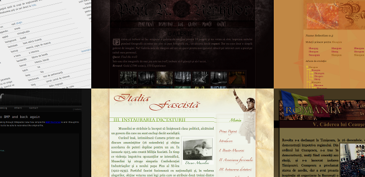

# Minimul

A Vagrant configuration for storing all my old websites. It's not complete.

## Running it

Get the submodules:

    git submodule init
    git submodule update

Bring up the machine.

    vagrant up

Go in the machine:

    vagrant ssh

From inside the machine, install the sites:

    sudo /vagrant/scripts/install-sites.py

Add this to your `/etc/hosts` file in order to access all domains:

    10.10.10.10 minimul.ro paulscripts.minimul.ro collegesite.minimul.ro collegesite2.minimul.ro italiafascista.minimul.ro rstsd.minimul.ro meetfirefox.minimul.ro timr.minimul.ro

## Deploying

The DigitalOcean keys must be on a line in `private/api_key` and
`private/client_id`. After that:

    vagrant plugin install vagrant-digitalocean
    vagrant up --provider=digital_ocean

## License

MIT
